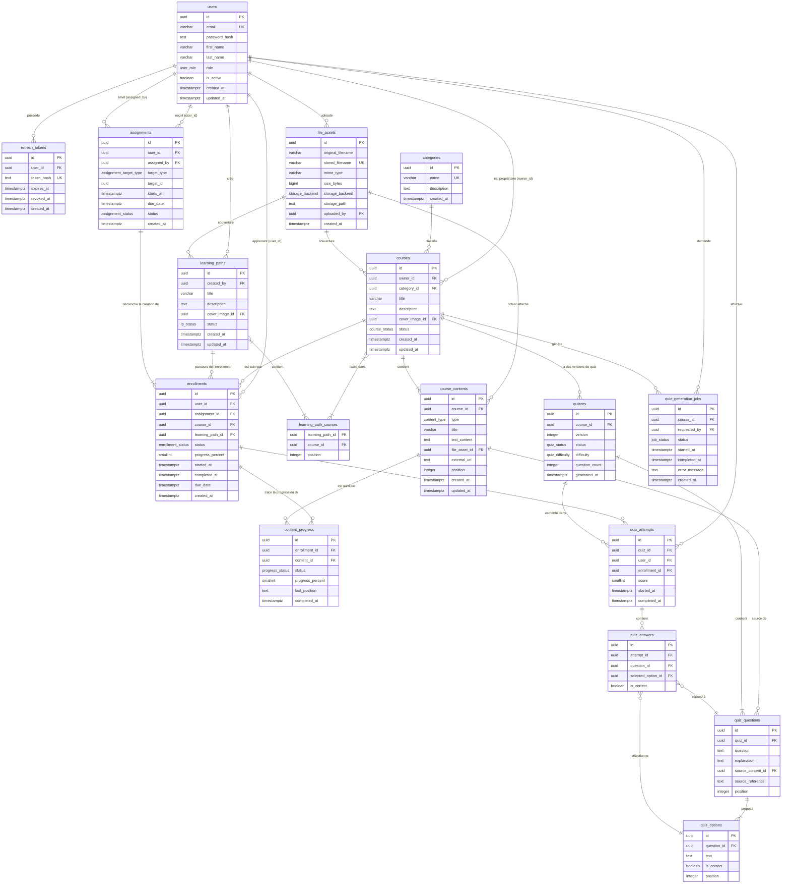

# DATABASE.md — Modèle de données PostgreSQL

> **Sources** : `readme.md` et `ARCHITECTURE.md`  
> Ce document est la référence canonique pour le schéma de base de données. Les modèles SQLAlchemy devront en être la transcription exacte.

---

## Table des matières

1. [Principes généraux](#1-principes-généraux)
2. [Types personnalisés (ENUMs)](#2-types-personnalisés-enums)
3. [Définition des tables](#3-définition-des-tables)
4. [Index complets](#4-index-complets)
5. [Règles de suppression (ON DELETE)](#5-règles-de-suppression-on-delete)
6. [Règles d'intégrité métier](#6-règles-dintégrité-métier)
7. [Cardinalités et relations](#7-cardinalités-et-relations)
8. [Vérification des invariants métier](#8-vérification-des-invariants-métier)
9. [Diagramme Mermaid ER](#9-diagramme-mermaid-er)

---

## 1. Principes généraux

| Décision | Justification |
|----------|---------------|
| **UUID v4** pour tous les IDs (`gen_random_uuid()`) | Pas d'exposition d'information d'ordre ou de volume via les IDs ; compatible avec les imports et la distribution future |
| **TIMESTAMPTZ** (avec fuseau) pour toutes les dates | Comparaisons correctes à travers les fuseaux horaires ; PostgreSQL stocke en UTC |
| **Soft-delete** pour `users` (`is_active = FALSE`) | Préserve l'intégrité référentielle et l'historique (quiz, enrollments, cours) |
| **ENUMs PostgreSQL** natifs | Contrainte au niveau moteur + lisibilité des requêtes + validation sans trigger |
| **Fichiers binaires hors PostgreSQL** | La table `file_assets` contient uniquement les métadonnées ; les octets sont dans un volume ou un objet-store |
| **`quiz_options` table dédiée** (pas JSONB) | Intégrité référentielle complète : `quiz_answers.selected_option_id` est une vraie FK ; audit et cohérence garantis par le moteur |
| **`is_correct` sur `quiz_options`** (pas `correct_option_id` sur `quiz_questions`) | Évite la dépendance circulaire FK `quiz_questions ↔ quiz_options` ; source de vérité unique ; unicité partielle garantie par un index |
| **Dénormalisation partielle dans `enrollments`** (`course_id`, `learning_path_id`) | Évite un JOIN sur `assignments` pour les requêtes de progression courantes ; cohérence garantie par le service à la création (champs immuables) |

---

## 2. Types personnalisés (ENUMs)

```sql
CREATE TYPE user_role               AS ENUM ('ADMIN', 'USER');
CREATE TYPE course_status           AS ENUM ('DRAFT', 'PUBLISHED', 'ARCHIVED');
CREATE TYPE content_type            AS ENUM ('TEXT', 'PDF', 'CSV', 'AUDIO', 'WEB_LINK');
CREATE TYPE storage_backend         AS ENUM ('LOCAL', 'S3');
CREATE TYPE lp_status               AS ENUM ('DRAFT', 'PUBLISHED', 'ARCHIVED');
CREATE TYPE assignment_target_type  AS ENUM ('COURSE', 'LEARNING_PATH');
CREATE TYPE assignment_status       AS ENUM ('PENDING', 'ACTIVE', 'COMPLETED', 'EXPIRED', 'CANCELLED');
CREATE TYPE enrollment_status       AS ENUM ('NOT_STARTED', 'IN_PROGRESS', 'COMPLETED', 'OVERDUE', 'CANCELLED');
CREATE TYPE progress_status         AS ENUM ('NOT_STARTED', 'IN_PROGRESS', 'COMPLETED');
CREATE TYPE quiz_status             AS ENUM ('DRAFT', 'ACTIVE', 'ARCHIVED');
CREATE TYPE quiz_difficulty         AS ENUM ('EASY', 'MEDIUM', 'HARD');
CREATE TYPE job_status              AS ENUM ('PENDING', 'PROCESSING', 'COMPLETED', 'FAILED');
```

---

## 3. Définition des tables

### 3.1 `users`

Représente tout compte humain de la plateforme. Un `USER` peut simultanément être propriétaire de cours et apprenant d'autres cours — ces deux rôles sont portés par des tables distinctes (`courses.owner_id` vs `enrollments.user_id`).

```sql
CREATE TABLE users (
    id            UUID         PRIMARY KEY DEFAULT gen_random_uuid(),
    email         VARCHAR(255) NOT NULL,
    password_hash TEXT         NOT NULL,
    first_name    VARCHAR(100) NOT NULL,
    last_name     VARCHAR(100) NOT NULL,
    role          user_role    NOT NULL DEFAULT 'USER',
    is_active     BOOLEAN      NOT NULL DEFAULT TRUE,
    created_at    TIMESTAMPTZ  NOT NULL DEFAULT now(),
    updated_at    TIMESTAMPTZ  NOT NULL DEFAULT now(),

    CONSTRAINT uq_users_email UNIQUE (email)
);
```

**Contraintes métier** :
- `email` doit être validé côté applicatif (format RFC 5321) avant insertion.
- `password_hash` contient le hash Argon2id ; jamais le mot de passe en clair.
- La suppression d'un `user` est interdite si des données dépendantes existent ; on désactive le compte (`is_active = FALSE`).

---

### 3.2 `refresh_tokens`

Stocke les refresh tokens actifs pour la rotation de session. Un refresh token révoqué reste visible (pour la détection de réutilisation).

```sql
CREATE TABLE refresh_tokens (
    id          UUID        PRIMARY KEY DEFAULT gen_random_uuid(),
    user_id     UUID        NOT NULL,
    token_hash  TEXT        NOT NULL,
    expires_at  TIMESTAMPTZ NOT NULL,
    revoked_at  TIMESTAMPTZ,                    -- NULL = token actif
    created_at  TIMESTAMPTZ NOT NULL DEFAULT now(),

    CONSTRAINT fk_refresh_tokens_user
        FOREIGN KEY (user_id) REFERENCES users (id) ON DELETE CASCADE,

    CONSTRAINT uq_refresh_tokens_hash UNIQUE (token_hash)
);
```

**Justification de `token_hash`** : le token brut est un UUID opaque envoyé dans un cookie `HttpOnly`. Stocker son hash (SHA-256) en base protège les tokens si la base est compromise.

**Règle de suppression** : `CASCADE` — les tokens n'ont aucun sens sans leur utilisateur.

---

### 3.3 `categories`

Taxonomie des cours, gérée uniquement par l'ADMIN.

```sql
CREATE TABLE categories (
    id          UUID         PRIMARY KEY DEFAULT gen_random_uuid(),
    name        VARCHAR(100) NOT NULL,
    description TEXT,
    created_at  TIMESTAMPTZ  NOT NULL DEFAULT now(),

    CONSTRAINT uq_categories_name UNIQUE (name)
);
```

**Règle de suppression** : la suppression d'une catégorie positionne `courses.category_id` à NULL (`SET NULL`) — les cours ne sont pas supprimés.

---

### 3.4 `file_assets`

Métadonnées des fichiers binaires (images, PDF, CSV, audio). Les octets sont dans le backend de stockage (volume Docker ou S3). PostgreSQL ne contient que le pointeur.

```sql
CREATE TABLE file_assets (
    id                UUID             PRIMARY KEY DEFAULT gen_random_uuid(),
    original_filename VARCHAR(255)     NOT NULL,
    stored_filename   VARCHAR(255)     NOT NULL,   -- UUID-based, jamais le nom original
    mime_type         VARCHAR(100)     NOT NULL,
    size_bytes        BIGINT           NOT NULL CHECK (size_bytes > 0),
    storage_backend   storage_backend  NOT NULL DEFAULT 'LOCAL',
    storage_path      TEXT             NOT NULL,   -- chemin relatif dans le backend
    uploaded_by       UUID             NOT NULL,
    created_at        TIMESTAMPTZ      NOT NULL DEFAULT now(),

    CONSTRAINT fk_file_assets_uploaded_by
        FOREIGN KEY (uploaded_by) REFERENCES users (id) ON DELETE RESTRICT,

    CONSTRAINT uq_file_assets_stored_filename UNIQUE (stored_filename)
);
```

**Justification de `stored_filename` distinct** : le nom interne est généré par le backend (`<uuid4>.<ext>`) — prévient les path traversal attacks et les conflits de noms sur le système de fichiers. `original_filename` est réservé à l'affichage.

**Règle de suppression** :
- `uploaded_by` → RESTRICT (on ne supprime pas un user avec des fichiers).
- Les tables référençant `file_assets` utilisent `ON DELETE SET NULL` (perte du fichier ≠ perte du cours/contenu).

---

### 3.5 `courses`

Unité pédagogique centrale. Chaque cours appartient à exactement un propriétaire (`owner_id`) et ne peut être modifié que par lui ou un ADMIN.

```sql
CREATE TABLE courses (
    id             UUID          PRIMARY KEY DEFAULT gen_random_uuid(),
    owner_id       UUID          NOT NULL,
    category_id    UUID,
    title          VARCHAR(255)  NOT NULL,
    description    TEXT,
    cover_image_id UUID,
    status         course_status NOT NULL DEFAULT 'DRAFT',
    created_at     TIMESTAMPTZ   NOT NULL DEFAULT now(),
    updated_at     TIMESTAMPTZ   NOT NULL DEFAULT now(),

    CONSTRAINT fk_courses_owner
        FOREIGN KEY (owner_id) REFERENCES users (id) ON DELETE RESTRICT,

    CONSTRAINT fk_courses_category
        FOREIGN KEY (category_id) REFERENCES categories (id) ON DELETE SET NULL,

    CONSTRAINT fk_courses_cover_image
        FOREIGN KEY (cover_image_id) REFERENCES file_assets (id) ON DELETE SET NULL
);
```

**Invariant critique** : `owner_id` est défini à la création via `current_user.id` et n'est **jamais** modifiable via l'API (exclu des schémas Pydantic de mise à jour).

**Règles de suppression** :
- `owner_id` → RESTRICT (impossible de supprimer un user propriétaire de cours).
- `category_id` → SET NULL (suppression catégorie ≠ suppression cours).
- `cover_image_id` → SET NULL (suppression image ≠ suppression cours).
- La suppression d'un cours est bloquée au niveau applicatif si des `enrollments` actifs existent.

---

### 3.6 `course_contents`

Contenus pédagogiques ordonnés d'un cours. Exactement un vecteur de contenu par ligne (`text_content`, `file_asset_id` ou `external_url`) selon le `type`.

```sql
CREATE TABLE course_contents (
    id            UUID         PRIMARY KEY DEFAULT gen_random_uuid(),
    course_id     UUID         NOT NULL,
    type          content_type NOT NULL,
    title         VARCHAR(255) NOT NULL,
    text_content  TEXT,                          -- utilisé si type = TEXT
    file_asset_id UUID,                          -- utilisé si type = PDF | CSV | AUDIO
    external_url  TEXT,                          -- utilisé si type = WEB_LINK
    position      INTEGER      NOT NULL DEFAULT 0,
    created_at    TIMESTAMPTZ  NOT NULL DEFAULT now(),
    updated_at    TIMESTAMPTZ  NOT NULL DEFAULT now(),

    CONSTRAINT fk_course_contents_course
        FOREIGN KEY (course_id) REFERENCES courses (id) ON DELETE CASCADE,

    CONSTRAINT fk_course_contents_file_asset
        FOREIGN KEY (file_asset_id) REFERENCES file_assets (id) ON DELETE SET NULL,

    -- Exactement un vecteur non-nul selon le type
    CONSTRAINT chk_content_vector CHECK (
        (type = 'TEXT'     AND text_content  IS NOT NULL AND file_asset_id IS NULL AND external_url IS NULL)
     OR (type IN ('PDF', 'CSV', 'AUDIO') AND file_asset_id IS NOT NULL AND text_content IS NULL AND external_url IS NULL)
     OR (type = 'WEB_LINK' AND external_url IS NOT NULL AND text_content IS NULL AND file_asset_id IS NULL)
    )
);
```

**Règles de suppression** :
- `course_id` → CASCADE (les contenus appartiennent au cours).
- `file_asset_id` → SET NULL (la suppression d'un fichier rend le contenu "orphelin" mais ne le supprime pas ; la cohérence est gérée au niveau applicatif).

---

### 3.7 `learning_paths`

Parcours d'apprentissage composé de cours ordonnés. Soumis aux mêmes règles d'ownership que `courses` (via `created_by`).

```sql
CREATE TABLE learning_paths (
    id             UUID      PRIMARY KEY DEFAULT gen_random_uuid(),
    created_by     UUID      NOT NULL,
    title          VARCHAR(255) NOT NULL,
    description    TEXT,
    cover_image_id UUID,
    status         lp_status NOT NULL DEFAULT 'DRAFT',
    created_at     TIMESTAMPTZ NOT NULL DEFAULT now(),
    updated_at     TIMESTAMPTZ NOT NULL DEFAULT now(),

    CONSTRAINT fk_learning_paths_creator
        FOREIGN KEY (created_by) REFERENCES users (id) ON DELETE RESTRICT,

    CONSTRAINT fk_learning_paths_cover_image
        FOREIGN KEY (cover_image_id) REFERENCES file_assets (id) ON DELETE SET NULL
);
```

**Ownership** : `created_by` joue le même rôle que `courses.owner_id`. Même règle d'isolation : un USER ne peut pas modifier le learning path d'un autre USER.

---

### 3.8 `learning_path_courses`

Table de jointure N:M entre `learning_paths` et `courses`. Gère l'ordre des cours au sein du parcours.

```sql
CREATE TABLE learning_path_courses (
    learning_path_id UUID    NOT NULL,
    course_id        UUID    NOT NULL,
    position         INTEGER NOT NULL DEFAULT 0,

    CONSTRAINT pk_learning_path_courses
        PRIMARY KEY (learning_path_id, course_id),

    CONSTRAINT fk_lpc_learning_path
        FOREIGN KEY (learning_path_id) REFERENCES learning_paths (id) ON DELETE CASCADE,

    CONSTRAINT fk_lpc_course
        FOREIGN KEY (course_id) REFERENCES courses (id) ON DELETE CASCADE
);
```

**Règles de suppression** :
- `learning_path_id` → CASCADE (suppression LP supprime ses associations de cours).
- `course_id` → CASCADE (suppression cours supprime ses associations de LP).

---

### 3.9 `assignments`

Acte administratif par lequel un ADMIN affecte un apprenant à un cours ou un parcours. **Concept distinct de `enrollments`** : l'assignment est la décision administrative ; l'enrollment est le suivi pédagogique qui en découle.

```sql
CREATE TABLE assignments (
    id          UUID                    PRIMARY KEY DEFAULT gen_random_uuid(),
    user_id     UUID                    NOT NULL,
    assigned_by UUID                    NOT NULL,
    target_type assignment_target_type  NOT NULL,
    target_id   UUID                    NOT NULL,   -- FK polymorphique : course_id ou lp_id
    starts_at   TIMESTAMPTZ,                        -- NULL = effectif immédiatement
    due_date    TIMESTAMPTZ,
    status      assignment_status       NOT NULL DEFAULT 'PENDING',
    created_at  TIMESTAMPTZ             NOT NULL DEFAULT now(),

    CONSTRAINT fk_assignments_user
        FOREIGN KEY (user_id) REFERENCES users (id) ON DELETE RESTRICT,

    CONSTRAINT fk_assignments_assigned_by
        FOREIGN KEY (assigned_by) REFERENCES users (id) ON DELETE RESTRICT,

    -- Un utilisateur ne peut pas être affecté deux fois au même target actif
    CONSTRAINT uq_assignments_active
        UNIQUE (user_id, target_type, target_id)
        -- affiné au niveau applicatif : exclut les statuts CANCELLED/COMPLETED
);
```

**Justification du polymorphisme (`target_type` + `target_id`)** : évite deux colonnes nullable (`course_id NULL, learning_path_id NOT NULL` ou l'inverse) ; extensible sans migration de schéma (ex. ajout d'un type `ASSESSMENT`). La cohérence avec les tables cibles est vérifiée au niveau du service (pas de FK polymorphique en SQL standard).

**Machine d'états** :
```
PENDING  →  ACTIVE     (starts_at atteint, ou immédiatement si NULL)
ACTIVE   →  COMPLETED  (tous les enrollments associés sont COMPLETED)
ACTIVE   →  EXPIRED    (due_date dépassée sans complétion)
PENDING|ACTIVE  →  CANCELLED  (action ADMIN)
```

---

### 3.10 `enrollments`

Enregistrement du suivi pédagogique d'un apprenant pour un cours. Créé automatiquement par le système lors de la création d'un `assignment`. Jamais créé manuellement par le learner.

```sql
CREATE TABLE enrollments (
    id               UUID              PRIMARY KEY DEFAULT gen_random_uuid(),
    user_id          UUID              NOT NULL,
    assignment_id    UUID              NOT NULL,
    course_id        UUID              NOT NULL,    -- toujours renseigné (unité atomique)
    learning_path_id UUID,                          -- renseigné si issu d'un LP assignment
    status           enrollment_status NOT NULL DEFAULT 'NOT_STARTED',
    progress_percent SMALLINT          NOT NULL DEFAULT 0
                         CHECK (progress_percent BETWEEN 0 AND 100),
    started_at       TIMESTAMPTZ,
    completed_at     TIMESTAMPTZ,
    due_date         TIMESTAMPTZ,                   -- copié de assignment.due_date à la création
    created_at       TIMESTAMPTZ       NOT NULL DEFAULT now(),

    CONSTRAINT fk_enrollments_user
        FOREIGN KEY (user_id) REFERENCES users (id) ON DELETE RESTRICT,

    CONSTRAINT fk_enrollments_assignment
        FOREIGN KEY (assignment_id) REFERENCES assignments (id) ON DELETE RESTRICT,

    CONSTRAINT fk_enrollments_course
        FOREIGN KEY (course_id) REFERENCES courses (id) ON DELETE RESTRICT,

    CONSTRAINT fk_enrollments_learning_path
        FOREIGN KEY (learning_path_id) REFERENCES learning_paths (id) ON DELETE SET NULL,

    -- Un apprenant ne peut être inscrit qu'une fois par cours par assignment
    CONSTRAINT uq_enrollments_assignment_course UNIQUE (assignment_id, course_id)
);
```

**Distinction Assignment / Enrollment** :

| | Assignment | Enrollment |
|-|-----------|-----------|
| Créé par | ADMIN | Système (automatique) |
| Représente | Décision administrative | Suivi pédagogique |
| Contient | Qui, Quoi, Deadline | Progression, Statut d'apprentissage |
| Modifiable | Oui (ADMIN) | Mis à jour par le système |
| Référencé par | Enrollments | ContentProgress, QuizAttempts |

**Dénormalisation de `course_id` et `learning_path_id`** : ces valeurs sont copiées depuis l'assignment à la création et sont **immuables**. Elles permettent des requêtes directes sur `enrollments` sans JOIN sur `assignments`.

**Création pour un LP assignment** : pour chaque cours dans le learning path, une enrollment est créée avec `course_id = cours_N` et `learning_path_id = lp_id`. La progression globale du LP est calculée comme la moyenne des `progress_percent` de ces enrollments.

**Machine d'états** :
```
NOT_STARTED  →  IN_PROGRESS  (premier accès à un contenu du cours)
IN_PROGRESS  →  COMPLETED    (progress_percent atteint 100)
IN_PROGRESS  →  OVERDUE      (due_date dépassée sans COMPLETED)
NOT_STARTED|IN_PROGRESS  →  CANCELLED  (assignment parent annulé)
```

---

### 3.11 `content_progress`

Suivi de la progression d'un apprenant sur chaque contenu pédagogique individuel, dans le contexte d'une enrollment.

```sql
CREATE TABLE content_progress (
    id               UUID            PRIMARY KEY DEFAULT gen_random_uuid(),
    enrollment_id    UUID            NOT NULL,
    content_id       UUID            NOT NULL,
    status           progress_status NOT NULL DEFAULT 'NOT_STARTED',
    progress_percent SMALLINT        NOT NULL DEFAULT 0
                         CHECK (progress_percent BETWEEN 0 AND 100),
    last_position    TEXT,           -- ex. "00:04:32" pour audio, "12" pour page PDF
    completed_at     TIMESTAMPTZ,

    CONSTRAINT fk_content_progress_enrollment
        FOREIGN KEY (enrollment_id) REFERENCES enrollments (id) ON DELETE CASCADE,

    CONSTRAINT fk_content_progress_content
        FOREIGN KEY (content_id) REFERENCES course_contents (id) ON DELETE CASCADE,

    CONSTRAINT uq_content_progress UNIQUE (enrollment_id, content_id)
);
```

**Calcul de `enrollments.progress_percent`** :
```sql
progress_percent = COUNT(*) FILTER (WHERE status = 'COMPLETED')
                 / COUNT(*)::float * 100
-- sur content_progress WHERE enrollment_id = $1
```
Ce calcul est déclenché par le service à chaque mise à jour d'un `content_progress`, et persisté dans `enrollments.progress_percent`.

**Règles de suppression** :
- `enrollment_id` → CASCADE (la progression n'a pas de sens sans l'enrollment).
- `content_id` → CASCADE (si un contenu est supprimé, sa progression disparaît).

---

### 3.12 `quizzes`

Une ligne par version de quiz par cours. Chaque régénération incrémente `version`. Les tentatives sont liées à une version précise, garantissant la cohérence historique.

```sql
CREATE TABLE quizzes (
    id             UUID             PRIMARY KEY DEFAULT gen_random_uuid(),
    course_id      UUID             NOT NULL,
    version        INTEGER          NOT NULL DEFAULT 1 CHECK (version >= 1),
    status         quiz_status      NOT NULL DEFAULT 'DRAFT',
    difficulty     quiz_difficulty  NOT NULL DEFAULT 'MEDIUM',
    question_count INTEGER          NOT NULL CHECK (question_count >= 1),
    generated_at   TIMESTAMPTZ,

    CONSTRAINT fk_quizzes_course
        FOREIGN KEY (course_id) REFERENCES courses (id) ON DELETE CASCADE,

    CONSTRAINT uq_quizzes_course_version UNIQUE (course_id, version)
);
```

**Garantie de cohérence historique** : `quiz_attempts.quiz_id` pointe vers la version exacte du quiz utilisée au moment de la tentative. Quand une nouvelle version est générée, l'ancienne passe à `ARCHIVED` ; les tentatives existantes ne sont pas touchées.

**Machine d'états du quiz** :
```
DRAFT    →  ACTIVE    (génération terminée avec succès)
ACTIVE   →  ARCHIVED  (nouvelle version générée, l'ancienne est archivée)
```

**Règles de suppression** :
- `course_id` → CASCADE (la suppression d'un cours supprime ses quiz — mais seulement si aucun quiz n'a de tentatives, via RESTRICT sur `quiz_attempts`).

---

### 3.13 `quiz_questions`

Questions générées automatiquement, liées à une version précise du quiz. Jamais créées manuellement.

```sql
CREATE TABLE quiz_questions (
    id                UUID    PRIMARY KEY DEFAULT gen_random_uuid(),
    quiz_id           UUID    NOT NULL,
    question          TEXT    NOT NULL,
    explanation       TEXT    NOT NULL,   -- obligatoire : justification de la bonne réponse
    source_content_id UUID,              -- contenu pédagogique source de la question
    source_reference  TEXT,              -- ex. "paragraphe 3", "page 12", "00:02:10"
    position          INTEGER NOT NULL DEFAULT 0,

    CONSTRAINT fk_quiz_questions_quiz
        FOREIGN KEY (quiz_id) REFERENCES quizzes (id) ON DELETE CASCADE,

    CONSTRAINT fk_quiz_questions_source_content
        FOREIGN KEY (source_content_id) REFERENCES course_contents (id) ON DELETE SET NULL
);
```

**Règle de suppression** :
- `quiz_id` → CASCADE (questions appartiennent à leur version de quiz).
- `source_content_id` → SET NULL (si un contenu source est supprimé, la question reste valide mais perd sa référence).

---

### 3.14 `quiz_options`

Options de réponse pour chaque question. La bonne réponse est identifiée par `is_correct = TRUE`.

```sql
CREATE TABLE quiz_options (
    id          UUID    PRIMARY KEY DEFAULT gen_random_uuid(),
    question_id UUID    NOT NULL,
    text        TEXT    NOT NULL,
    is_correct  BOOLEAN NOT NULL DEFAULT FALSE,
    position    INTEGER NOT NULL DEFAULT 0,

    CONSTRAINT fk_quiz_options_question
        FOREIGN KEY (question_id) REFERENCES quiz_questions (id) ON DELETE CASCADE
);

-- Exactement une option correcte par question (contrainte d'unicité partielle)
CREATE UNIQUE INDEX uq_quiz_options_one_correct_per_question
    ON quiz_options (question_id)
    WHERE is_correct = TRUE;
```

**Justification du choix `quiz_options` table plutôt que JSONB** :
- `quiz_answers.selected_option_id` est une vraie FK → intégrité référentielle complète.
- L'absence de `correct_option_id` sur `quiz_questions` évite la dépendance circulaire FK (`quiz_questions ↔ quiz_options`).
- L'index partiel `WHERE is_correct = TRUE` garantit qu'il existe au plus une bonne réponse par question (contrainte DB). L'existence d'au moins une bonne réponse est garantie par validation Pydantic lors de la génération.
- Position `SMALLINT` permet le réordonnancement des options dans l'UI.

**Invariant** : chaque `quiz_question` doit avoir entre 3 et 5 `quiz_options`, dont exactement une avec `is_correct = TRUE`. Validé à la génération par le pipeline AI + Pydantic.

**Règle de suppression** :
- `question_id` → CASCADE (options appartiennent à leur question).
- Les options référencées par des `quiz_answers` sont protégées en cascade via RESTRICT sur `quiz_attempts → quizzes`.

---

### 3.15 `quiz_generation_jobs`

Trace asynchrone du pipeline de génération de quiz. Le frontend poll ce statut.

```sql
CREATE TABLE quiz_generation_jobs (
    id            UUID       PRIMARY KEY DEFAULT gen_random_uuid(),
    course_id     UUID       NOT NULL,
    requested_by  UUID       NOT NULL,
    status        job_status NOT NULL DEFAULT 'PENDING',
    started_at    TIMESTAMPTZ,
    completed_at  TIMESTAMPTZ,
    error_message TEXT,
    created_at    TIMESTAMPTZ NOT NULL DEFAULT now(),

    CONSTRAINT fk_quiz_gen_jobs_course
        FOREIGN KEY (course_id) REFERENCES courses (id) ON DELETE CASCADE,

    CONSTRAINT fk_quiz_gen_jobs_requested_by
        FOREIGN KEY (requested_by) REFERENCES users (id) ON DELETE RESTRICT
);
```

**Machine d'états** :
```
PENDING  →  PROCESSING  (worker démarre)
PROCESSING  →  COMPLETED  (quiz + questions + options persistés)
PROCESSING  →  FAILED     (erreur pipeline, message stocké dans error_message)
```

**Règle de suppression** : `course_id` → CASCADE (les jobs de génération appartiennent au cours).

---

### 3.16 `quiz_attempts`

Tentative d'un apprenant sur une version précise d'un quiz. Plusieurs tentatives sont possibles par apprenant et par quiz.

```sql
CREATE TABLE quiz_attempts (
    id            UUID        PRIMARY KEY DEFAULT gen_random_uuid(),
    quiz_id       UUID        NOT NULL,
    user_id       UUID        NOT NULL,
    enrollment_id UUID        NOT NULL,
    score         SMALLINT    CHECK (score BETWEEN 0 AND 100),  -- NULL tant que non terminée
    started_at    TIMESTAMPTZ NOT NULL DEFAULT now(),
    completed_at  TIMESTAMPTZ,

    CONSTRAINT fk_quiz_attempts_quiz
        FOREIGN KEY (quiz_id) REFERENCES quizzes (id) ON DELETE RESTRICT,

    CONSTRAINT fk_quiz_attempts_user
        FOREIGN KEY (user_id) REFERENCES users (id) ON DELETE RESTRICT,

    CONSTRAINT fk_quiz_attempts_enrollment
        FOREIGN KEY (enrollment_id) REFERENCES enrollments (id) ON DELETE RESTRICT
);
```

**Justification de `ON DELETE RESTRICT` sur `quiz_id`** : une tentative est la preuve irréfutable de l'activité pédagogique d'un apprenant. Un quiz ayant des tentatives ne peut pas être supprimé — la suppression est ainsi bloquée en cascade depuis `courses`. Si un cours doit être supprimé alors qu'il a des tentatives, l'opération doit être refusée explicitement.

**Invariant** : une seule tentative `non terminée` (`completed_at IS NULL`) par `(user_id, quiz_id)` à la fois. Vérifié au niveau applicatif avant insertion.

**Dénormalisation de `user_id`** : bien que `user_id` soit dérivable depuis `enrollment_id`, il est présent pour les requêtes directes (`WHERE user_id = $1`) sans JOIN.

---

### 3.17 `quiz_answers`

Réponses individuelles d'une tentative. `is_correct` est calculé au moment de la soumission et persisté — il constitue un instantané immuable de la correction, indépendant d'une éventuelle modification future des options.

```sql
CREATE TABLE quiz_answers (
    id                 UUID    PRIMARY KEY DEFAULT gen_random_uuid(),
    attempt_id         UUID    NOT NULL,
    question_id        UUID    NOT NULL,
    selected_option_id UUID    NOT NULL,
    is_correct         BOOLEAN NOT NULL,

    CONSTRAINT fk_quiz_answers_attempt
        FOREIGN KEY (attempt_id) REFERENCES quiz_attempts (id) ON DELETE CASCADE,

    CONSTRAINT fk_quiz_answers_question
        FOREIGN KEY (question_id) REFERENCES quiz_questions (id) ON DELETE RESTRICT,

    CONSTRAINT fk_quiz_answers_selected_option
        FOREIGN KEY (selected_option_id) REFERENCES quiz_options (id) ON DELETE RESTRICT,

    -- Une seule réponse par question par tentative
    CONSTRAINT uq_quiz_answers_attempt_question UNIQUE (attempt_id, question_id)
);
```

**Justification de RESTRICT sur `question_id` et `selected_option_id`** : une réponse enregistrée ne doit jamais perdre sa référence à la question ou à l'option choisie. La chaîne RESTRICT `quiz_answers → quiz_options → quiz_questions → quizzes` garantit que toute la structure est préservée tant qu'une réponse existe.

**`is_correct` dénormalisé** : calculé à la soumission en comparant `selected_option_id` à l'option marquée `is_correct = TRUE` dans `quiz_options`. Persisté pour éviter un recalcul et rester cohérent même si la définition de la "bonne réponse" changeait ultérieurement (ce qui n'arrive pas, mais le modèle est robuste).

---

## 4. Index complets

```sql
-- users
CREATE UNIQUE INDEX idx_users_email ON users (email);

-- refresh_tokens
CREATE INDEX idx_refresh_tokens_user_id ON refresh_tokens (user_id);
CREATE INDEX idx_refresh_tokens_expires_at ON refresh_tokens (expires_at)
    WHERE revoked_at IS NULL;   -- nettoyage des tokens expirés

-- file_assets
CREATE INDEX idx_file_assets_uploaded_by ON file_assets (uploaded_by);

-- courses
CREATE INDEX idx_courses_owner_id ON courses (owner_id);
CREATE INDEX idx_courses_category_id ON courses (category_id);
CREATE INDEX idx_courses_status ON courses (status);
CREATE INDEX idx_courses_owner_status ON courses (owner_id, status);

-- course_contents
CREATE INDEX idx_course_contents_course_id_position
    ON course_contents (course_id, position);

-- learning_paths
CREATE INDEX idx_learning_paths_created_by ON learning_paths (created_by);
CREATE INDEX idx_learning_paths_status ON learning_paths (status);

-- learning_path_courses
CREATE INDEX idx_lpc_course_id ON learning_path_courses (course_id);

-- assignments
CREATE INDEX idx_assignments_user_id ON assignments (user_id);
CREATE INDEX idx_assignments_assigned_by ON assignments (assigned_by);
CREATE INDEX idx_assignments_target ON assignments (target_type, target_id);
CREATE INDEX idx_assignments_status ON assignments (status);

-- enrollments
CREATE INDEX idx_enrollments_user_id ON enrollments (user_id);
CREATE INDEX idx_enrollments_assignment_id ON enrollments (assignment_id);
CREATE INDEX idx_enrollments_course_id ON enrollments (course_id);
CREATE INDEX idx_enrollments_learning_path_id ON enrollments (learning_path_id)
    WHERE learning_path_id IS NOT NULL;
CREATE INDEX idx_enrollments_status ON enrollments (status);
CREATE INDEX idx_enrollments_user_course ON enrollments (user_id, course_id);

-- content_progress
CREATE INDEX idx_content_progress_enrollment_id ON content_progress (enrollment_id);
CREATE INDEX idx_content_progress_content_id ON content_progress (content_id);

-- quizzes
CREATE INDEX idx_quizzes_course_id ON quizzes (course_id);
CREATE INDEX idx_quizzes_course_status ON quizzes (course_id, status);

-- quiz_questions
CREATE INDEX idx_quiz_questions_quiz_id ON quiz_questions (quiz_id, position);
CREATE INDEX idx_quiz_questions_source_content ON quiz_questions (source_content_id)
    WHERE source_content_id IS NOT NULL;

-- quiz_options (index partiel déjà défini pour is_correct)
CREATE INDEX idx_quiz_options_question_id ON quiz_options (question_id, position);

-- quiz_generation_jobs
CREATE INDEX idx_quiz_gen_jobs_course_id ON quiz_generation_jobs (course_id);
CREATE INDEX idx_quiz_gen_jobs_status ON quiz_generation_jobs (status)
    WHERE status IN ('PENDING', 'PROCESSING');

-- quiz_attempts
CREATE INDEX idx_quiz_attempts_quiz_id ON quiz_attempts (quiz_id);
CREATE INDEX idx_quiz_attempts_user_id ON quiz_attempts (user_id);
CREATE INDEX idx_quiz_attempts_enrollment_id ON quiz_attempts (enrollment_id);
CREATE INDEX idx_quiz_attempts_open ON quiz_attempts (user_id, quiz_id)
    WHERE completed_at IS NULL;  -- détection des tentatives ouvertes

-- quiz_answers
CREATE INDEX idx_quiz_answers_attempt_id ON quiz_answers (attempt_id);
```

---

## 5. Règles de suppression (ON DELETE)

| Table enfant | Colonne FK | Référence | Règle | Justification |
|---|---|---|---|---|
| `refresh_tokens` | `user_id` | `users` | **CASCADE** | Token sans user est inutile |
| `file_assets` | `uploaded_by` | `users` | **RESTRICT** | Fichiers doivent avoir un propriétaire identifiable |
| `courses` | `owner_id` | `users` | **RESTRICT** | Cours ne peut pas être orphelin |
| `courses` | `category_id` | `categories` | **SET NULL** | La catégorie est optionnelle |
| `courses` | `cover_image_id` | `file_assets` | **SET NULL** | L'image est optionnelle |
| `course_contents` | `course_id` | `courses` | **CASCADE** | Contenu sans cours n'a pas de sens |
| `course_contents` | `file_asset_id` | `file_assets` | **SET NULL** | Suppression fichier ≠ suppression contenu |
| `learning_paths` | `created_by` | `users` | **RESTRICT** | LP ne peut pas être orpheline |
| `learning_paths` | `cover_image_id` | `file_assets` | **SET NULL** | L'image est optionnelle |
| `learning_path_courses` | `learning_path_id` | `learning_paths` | **CASCADE** | Association supprimée avec la LP |
| `learning_path_courses` | `course_id` | `courses` | **CASCADE** | Association supprimée avec le cours |
| `assignments` | `user_id` | `users` | **RESTRICT** | Assignment sans destinataire invalide |
| `assignments` | `assigned_by` | `users` | **RESTRICT** | Auditabilité : l'assignateur doit rester traçable |
| `enrollments` | `user_id` | `users` | **RESTRICT** | Enrollment sans apprenant invalide |
| `enrollments` | `assignment_id` | `assignments` | **RESTRICT** | Enrollment sans assignment perd son contexte administratif |
| `enrollments` | `course_id` | `courses` | **RESTRICT** | Enrollment sans cours invalide — bloquer la suppression |
| `enrollments` | `learning_path_id` | `learning_paths` | **SET NULL** | LP supprimée : l'enrollment devient un enrollment de cours simple |
| `content_progress` | `enrollment_id` | `enrollments` | **CASCADE** | La progression n'a pas de sens sans enrollment |
| `content_progress` | `content_id` | `course_contents` | **CASCADE** | La progression d'un contenu supprimé est obsolète |
| `quizzes` | `course_id` | `courses` | **CASCADE** | Quiz sans cours invalide |
| `quiz_questions` | `quiz_id` | `quizzes` | **CASCADE** | Questions appartiennent à leur version de quiz |
| `quiz_questions` | `source_content_id` | `course_contents` | **SET NULL** | La question reste valide sans sa référence source |
| `quiz_options` | `question_id` | `quiz_questions` | **CASCADE** | Options appartiennent à leur question |
| `quiz_generation_jobs` | `course_id` | `courses` | **CASCADE** | Jobs sont des artefacts du cours |
| `quiz_generation_jobs` | `requested_by` | `users` | **RESTRICT** | Auditabilité |
| `quiz_attempts` | `quiz_id` | `quizzes` | **RESTRICT** | Préserve l'historique — clé de la cohérence temporelle |
| `quiz_attempts` | `user_id` | `users` | **RESTRICT** | Tentative sans apprenant invalide |
| `quiz_attempts` | `enrollment_id` | `enrollments` | **RESTRICT** | Tentative liée au contexte d'apprentissage |
| `quiz_answers` | `attempt_id` | `quiz_attempts` | **CASCADE** | Réponses appartiennent à leur tentative |
| `quiz_answers` | `question_id` | `quiz_questions` | **RESTRICT** | Préserve la traçabilité de la réponse |
| `quiz_answers` | `selected_option_id` | `quiz_options` | **RESTRICT** | Préserve la traçabilité de l'option choisie |

---

## 6. Règles d'intégrité métier

Ces règles ne peuvent pas toutes être exprimées en SQL pur ; elles sont enforced par la couche service.

| Règle | Niveau d'enforcement |
|-------|----------------------|
| `courses.owner_id` est défini au moment de la création via `current_user.id` et n'est jamais modifiable | Service (exclu des schémas Pydantic de PATCH) |
| Un USER ne peut pas modifier ou supprimer le cours d'un autre USER | Service (`require_owner_or_admin` dependency) |
| Seul un ADMIN peut créer des assignments | Service + router permission |
| `assignments.assigned_by` est toujours `current_user.id` au moment de la création | Service |
| Un assignment crée automatiquement les enrollments correspondants | Service (transaction atomique) |
| `enrollments.course_id` et `enrollments.learning_path_id` sont immuables après création | Service (exclus des schémas de mise à jour) |
| `quiz_questions` ne sont jamais créées manuellement | Architecture : seul `QuizGenerationPipeline` peut insérer dans `quiz_questions` et `quiz_options` |
| Exactement une option correcte par question (`quiz_options.is_correct = TRUE`) | Index partiel DB (unicité max 1) + Validation Pydantic (min 1) |
| Pas plus d'une tentative ouverte (`completed_at IS NULL`) par `(user_id, quiz_id)` | Service (vérification avant INSERT) |
| `quiz_attempts.user_id` = `enrollment.user_id` pour l'enrollment référencé | Service (vérification lors du démarrage d'une tentative) |
| Lors d'une régénération de quiz, l'ancienne version passe à `ARCHIVED` | Service (transaction : nouveau quiz ACTIVE + ancien quiz ARCHIVED) |
| La suppression d'un cours avec des enrollments actifs est refusée | Service (vérification avant DELETE) |
| `users` ne sont jamais supprimés physiquement | Service (PATCH `is_active = FALSE`) |
| L'URL externe d'un contenu `WEB_LINK` ne peut pas cibler une IP privée/loopback | Service (validation avant INSERT dans `course_contents`) |

---

## 7. Cardinalités et relations

| Relation | Type | Notes |
|----------|------|-------|
| `users` → `courses` (owner) | 1:N | Un user possède N cours |
| `users` → `learning_paths` (created_by) | 1:N | Un user crée N LP |
| `users` → `assignments` (user_id) | 1:N | Un user reçoit N assignments |
| `users` → `assignments` (assigned_by) | 1:N | Un ADMIN crée N assignments |
| `users` → `enrollments` | 1:N | Un user a N enrollments (apprenant) |
| `users` → `quiz_attempts` | 1:N | Un user fait N tentatives |
| `users` → `file_assets` | 1:N | Un user uploade N fichiers |
| `categories` → `courses` | 1:N | Une catégorie classe N cours |
| `file_assets` → `courses` (cover) | 1:0..1 | Image de couverture optionnelle |
| `file_assets` → `learning_paths` (cover) | 1:0..1 | Image de couverture optionnelle |
| `file_assets` → `course_contents` | 1:0..1 | Fichier attaché à un contenu |
| `courses` → `course_contents` | 1:N | Un cours a N contenus ordonnés |
| `courses` ↔ `learning_paths` | N:M | Via `learning_path_courses` |
| `courses` → `quizzes` | 1:N | Un cours a N versions de quiz |
| `courses` → `quiz_generation_jobs` | 1:N | Un cours peut avoir N jobs d'historique |
| `courses` → `enrollments` | 1:N | Un cours peut avoir N enrollments |
| `assignments` → `enrollments` | 1:N | Un assignment crée 1 (COURSE) ou N (LP) enrollments |
| `enrollments` → `content_progress` | 1:N | Un enrollment a N enregistrements de progression |
| `enrollments` → `quiz_attempts` | 1:N | Un enrollment peut avoir N tentatives |
| `quizzes` → `quiz_questions` | 1:N | Un quiz a N questions |
| `quizzes` → `quiz_attempts` | 1:N | Un quiz peut avoir N tentatives |
| `quiz_questions` → `quiz_options` | 1:N (3–5) | Une question a entre 3 et 5 options |
| `quiz_attempts` → `quiz_answers` | 1:N | Une tentative a N réponses (une par question) |

---

## 8. Vérification des invariants métier

### Un USER peut créer ses propres cours

`courses.owner_id NOT NULL` + FK vers `users(id)`. Le service positionne `owner_id = current_user.id` à la création. Vérifiable :
```sql
SELECT c.id, c.title FROM courses c WHERE c.owner_id = :user_id;
```

### Un USER ne peut pas modifier le cours d'un autre USER

`courses.owner_id` est immutable (exclu des schémas de mise à jour). Le service vérifie systématiquement `course.owner_id == current_user.id OR current_user.role == 'ADMIN'` avant toute opération d'écriture. Cette règle n'est pas enforçable par une contrainte SQL seule.

### ADMIN peut tout gérer

Aucune contrainte DB n'empêche un ADMIN d'accéder à n'importe quelle ressource. La vérification est positionnée dans la couche service (`require_owner_or_admin`).

### Un USER peut être propriétaire d'un cours ET apprenant d'un autre

Ces deux rôles sont portés par deux chemins distincts dans le schéma :
```sql
-- Propriétaire de Course A
courses WHERE owner_id = :user_id

-- Apprenant de Course B (via enrollment)
enrollments WHERE user_id = :user_id AND course_id = :other_course_id
```
Il n'existe aucune contrainte interdisant la coexistence de ces deux enregistrements. Un user peut en outre s'auto-affecter un cours qu'il possède via un assignment ADMIN, mais ce n'est pas automatique (`Ownership ≠ Enrollment`).

### Assignment et Enrollment sont deux concepts différents

- `assignments` : acte administratif, créé par un ADMIN, jamais consulté directement par le learner pour sa progression.
- `enrollments` : suivi pédagogique, créé par le système, consulté par le learner pour sa progression, référencé par `content_progress` et `quiz_attempts`.
- Une suppression d'`assignment` est RESTRICT sur `enrollments` : l'historical d'apprentissage est préservé même si l'assignment est annulé (statut `CANCELLED` préféré).

### Les quiz sont générés automatiquement

Aucun endpoint ne permet un INSERT direct dans `quiz_questions` ou `quiz_options`. Seul `QuizGenerationPipeline` (service interne déclenché via `quiz_generation_jobs`) peut créer ces enregistrements.

### Les anciennes tentatives restent cohérentes lors d'une régénération

`quiz_attempts.quiz_id` → FK vers `quizzes(id)` ON DELETE RESTRICT. La régénération crée un nouveau `quizzes` (version + 1), archive l'ancien (status `ARCHIVED`), mais **ne supprime jamais** l'ancien quiz. Les tentatives passées continuent de pointer vers la version exacte qui était active au moment de la tentative.

```sql
-- Les anciens quiz_attempts pointent toujours vers leur version
SELECT qa.id, qa.score, q.version, q.status
FROM quiz_attempts qa
JOIN quizzes q ON q.id = qa.quiz_id
WHERE qa.user_id = :user_id AND q.course_id = :course_id
ORDER BY qa.started_at DESC;
-- Retourne des tentatives avec status = 'ARCHIVED' pour les anciennes versions
-- et status = 'ACTIVE' pour la version courante
```

---

## 9. Diagramme Mermaid ER



---

## Récapitulatif des tables

| Table | Lignes estimées (prod) | Rôle |
|-------|------------------------|------|
| `users` | Centaines | Comptes utilisateurs |
| `refresh_tokens` | ~2× users actifs | Sessions |
| `categories` | Dizaines | Taxonomie |
| `file_assets` | Milliers | Métadonnées fichiers |
| `courses` | Centaines | Catalogue de cours |
| `course_contents` | Milliers | Contenu pédagogique |
| `learning_paths` | Dizaines–centaines | Parcours |
| `learning_path_courses` | Milliers | Associations LP↔cours |
| `assignments` | Milliers | Affectations ADMIN |
| `enrollments` | Milliers–dizaines de milliers | Inscriptions pédagogiques |
| `content_progress` | Dizaines de milliers | Suivi granulaire |
| `quizzes` | Centaines (1–N par cours) | Versions de quiz |
| `quiz_questions` | Dizaines de milliers | Questions générées |
| `quiz_options` | 3–5× `quiz_questions` | Options de réponse |
| `quiz_generation_jobs` | Centaines | Historique des générations |
| `quiz_attempts` | Dizaines de milliers | Tentatives d'apprenants |
| `quiz_answers` | Centaines de milliers | Réponses individuelles |
